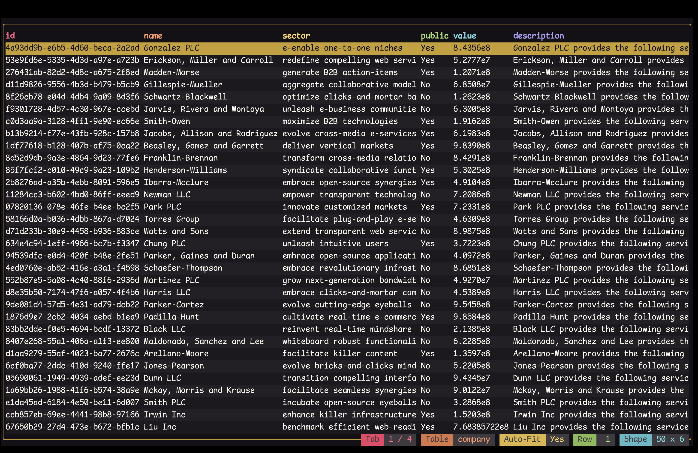
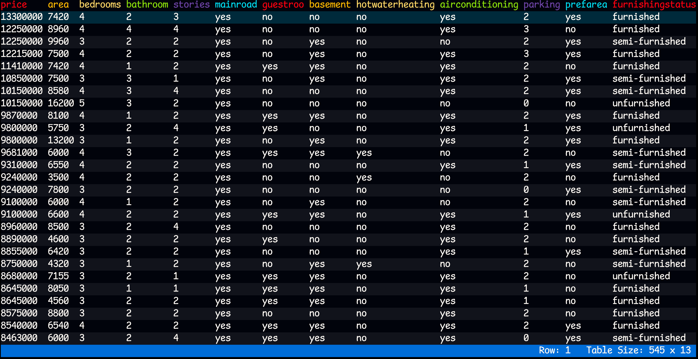
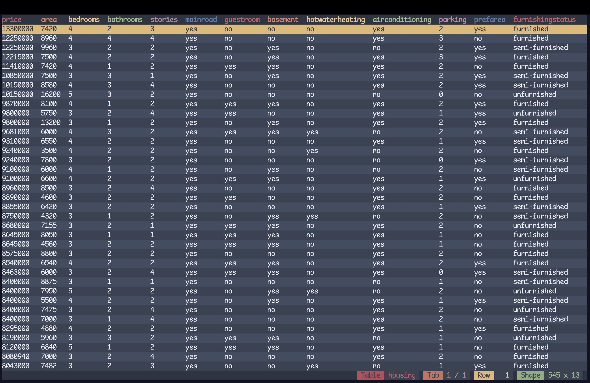
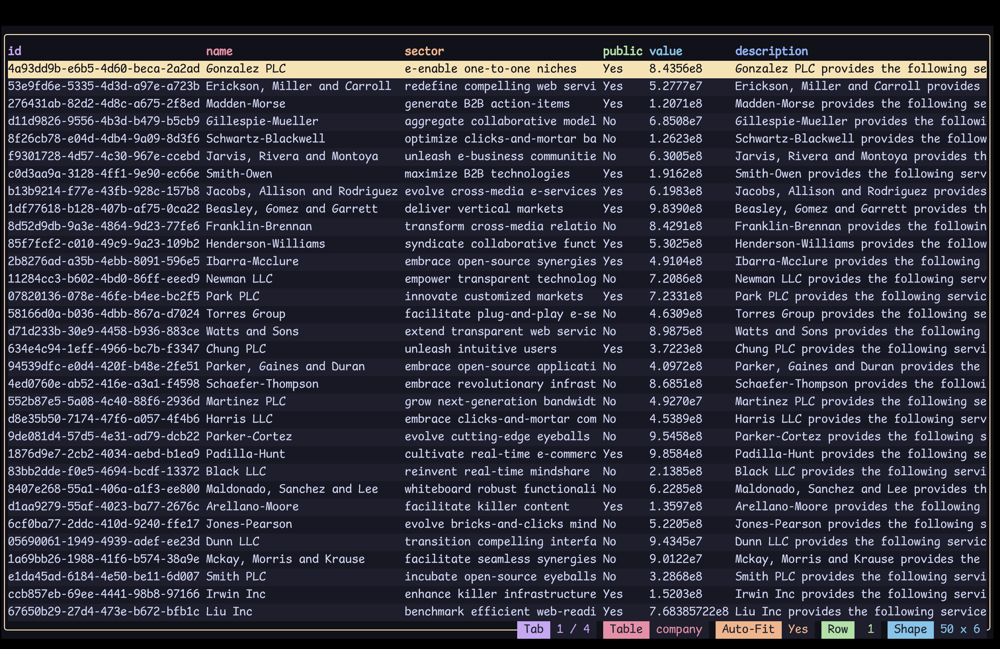

# Tabiew

Tabiew is a lightweight TUI application that allows users to view and query tabular data files, such as CSV, Parquet, Arrow, and ...


## Features

- ⌨️ Vim-style keybindings
- 🛠️ SQL support
- 📊 Support for CSV, TSV, Parquet, JSON, JSONL, Arrow, FWF, Sqlite, and Excel
- 🔍 Fuzzy search
- 📝 Scripting support
- 🗂️ Multi-table functionality
- 📈 Plotting
- 🎨 More than 400 beautiful themes

## Wiki

Tabiew started as a humble hobby TUI project for viewing CSV data but has evolved to incorporate various features and improvements from valuable community feedbacks. As the project expanded, so did the need for comprehensive documentation, leading to the creation of the [wiki page](https://github.com/shshemi/tabiew/wiki). The wiki offers explanations of features and the best practices to get the most out of Tabiew.

## Installation

There are various ways to install Tabiew:

### Arch Linux

You can install from the [official repositories](https://archlinux.org/packages/extra/x86_64/tabiew/) using [pacman](https://wiki.archlinux.org/title/pacman):
```bash
pacman -S tabiew
```

### Debian-based

Download the `.deb` package from the [GitHub releases page](https://github.com/shshemi/tabiew/releases) and run:
 ```bash
sudo dpkg -i <path_to_package.deb>
 ```

### RPM-based

Download the `.rpm` package from the [GitHub releases page](https://github.com/shshemi/tabiew/releases) and run:
 ```bash
sudo rpm -i <path_to_package.rpm>
 ```

### MacOS

Installing Tabiew using [Homebrew](https://brew.sh/) from Homebrew core:
```bash
brew update
brew install tabiew
```
or tap:
 ```bash
brew install shshemi/tabiew/tabiew
 ```

Note: Please be aware that installing Tabiew from the tap involves compiling it from the source, which may take some time to complete.

### Cargo

Installing Tabiew from *Crates.io*:
 ```bash
cargo install --locked tabiew
 ```

### Build from Source

Ensure you have rustc version 1.80 (or higher) installed. Download the desired source version from the [release page](https://github.com/shshemi/tabiew/releases). Extract the downloaded file and navigate into the extracted directory. Then run the following command:
```bash
cargo build --release
cp ./target/release/tw <system_or_local_bin_path>
```

## Usage

Start Tabiew with `tw`
```bash
tw <path_to_file(s)>
```

Tabiew automatically detects the file format based on the file extension. Supported formats include:
- **CSV** (`.csv`) - Comma-separated values
- **TSV** (`.tsv`) - Tab-separated values
- **Parquet** (`.parquet`, `.pqt`)
- **JSON** (`.json`)
- **JSONL** (`.jsonl`) - JSON Lines
- **Arrow** (`.arrow`)
- **FWF** (`.fwf`) - Fixed-width format
- **SQLite** (`.db`, `.sqlite`)
- **Excel** (`.xls`, `.xlsx`, `.xlsm`, `.xlsb`)

Examples:

Open various files (format automatically detected):
```bash
tw data.csv data.tsv data.arrow
```

Open CSV files with custom delimiter (pipe-separated):
```bash
tw data.csv --separator '|'
```

Open CSV files with custom delimiter and no header row (semicolon-separated):
```bash
tw data.csv --separator ';' --no-header
```

Override format detection:
```bash
tw data.txt -f parquet
```

Delimiter-separated formats (CSV, TSV, etc):
```bash
# Explicitly use CSV format (comma by default, but can use custom delimiter)
tw data.txt -f csv
tw data.txt -f csv --separator '|'

# Explicitly use TSV format (always tab-delimited)
tw data.txt -f tsv

# Use DSV with custom delimiter (equivalent to csv with --separator)
tw data.txt -f dsv --separator '|'
```

Open a URL using curl:
```bash
curl -s "https://raw.githubusercontent.com/wiki/shshemi/tabiew/housing.csv" | tw
```

## Useful Keybindings️

|Key Combination|Functionality|
|-|-|
| `F1`| Show help with all keyboard shortcuts|
| `Enter`| Open sheet|
| `h j k l` or `← ↓ ↑ →`| Navigation |
| `b` / `w` | Previous / next column|
| `e` | Toggle Auto-Fit|
| `Ctrl + u` / `Ctrl + d`| Move half page up/down|
| `Ctrl + b` / `Ctrl + f`| Move full page up/down|
| `Home` or `g`| Move to first row|
| `End` or `G`| Move to last row|
| `Ctrl + r`| Reset data frame|
| `q`| Close |
| `Q`| Quit Application |
| `:`| Command Palette|
| `/`| Fuzzy Search|

## Useful Commands

|Command|Example|Description|
|-|-|-|
|`Q` or `query`|`Q SELECT * FROM df`|Query the data in Structured Query Language(SQL). The table name is the file name without extension|
|`S` or `select`| `S price, area, bedrooms, parking`|Query current data frame for columns/functions|
|`F` or `filter`| `F price < 20000 AND bedrooms > 4`|Filter current data frame, keeping rows were the condition(s) match|
|`O` or `order`| `O area`|Sort current data frame by column(s)|
|`tabn`| `tabn SELECT * FORM user WHERE balance > 1000`|Create a new tab with the given query|
|`q` or `quit` |`q`| Return to table from sheet view otherwise quit|
|`schema`| `schema`| Show loaded data frame(s) alongside their path(s)|
|`reset`| `reset`| Reset the table to the original data frame|
|`help`| `help`| Show command reference in a new tab|


## Themes

### Monokai (default):



### Argonaut:



### Nord:



### Catppuccin:



### Tokyo Night:


## Contributing

Contributions are welcome! Please fork the repository and submit pull requests with your features and bug fixes.

## Acknowledgments

This application uses themes from the [Ghostty terminal](https://ghostty.org/).


## License

This project is licensed under the MIT License - see the LICENSE file for details.
