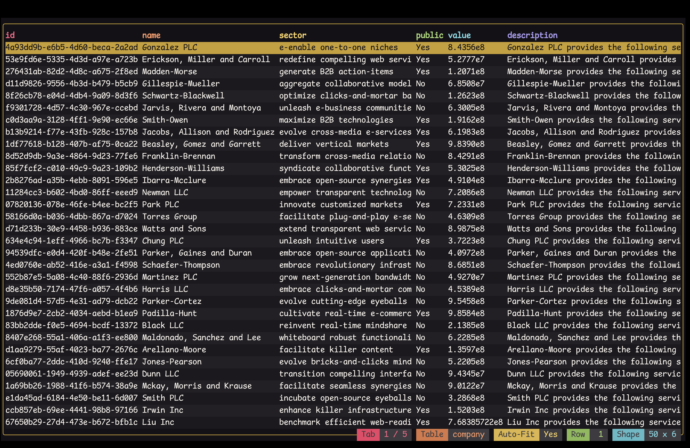
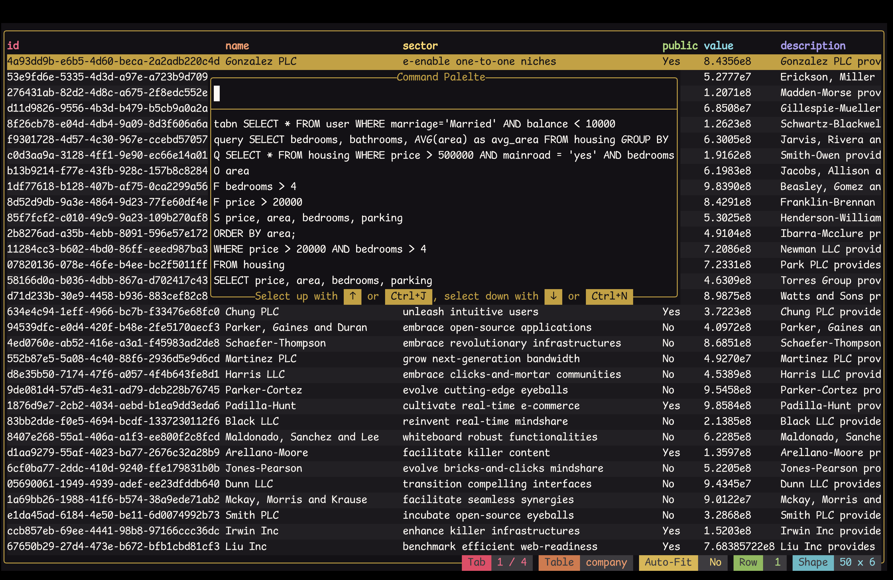
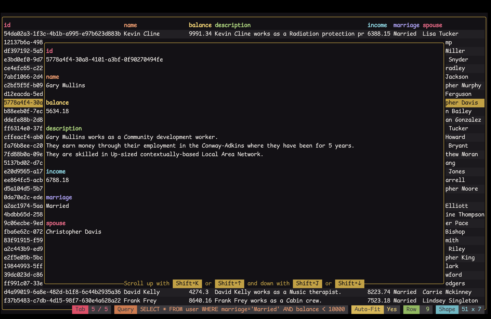
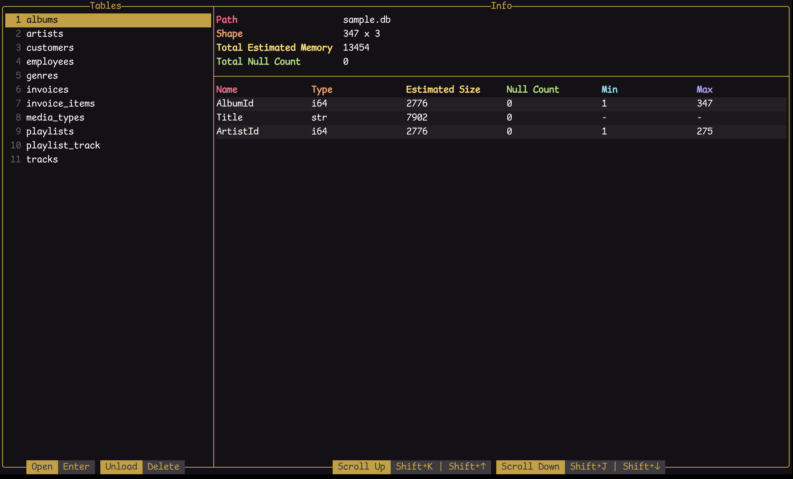
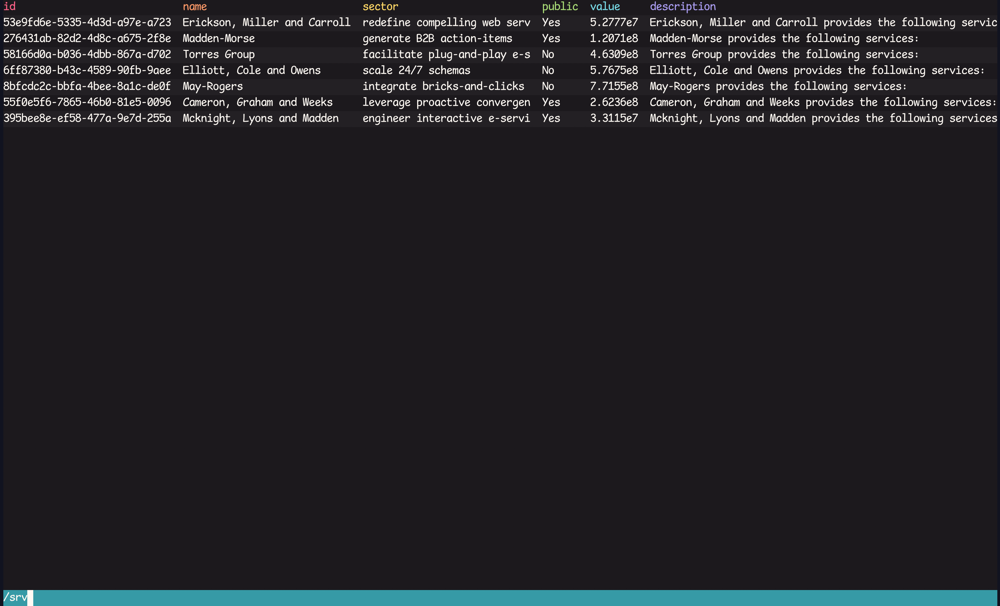
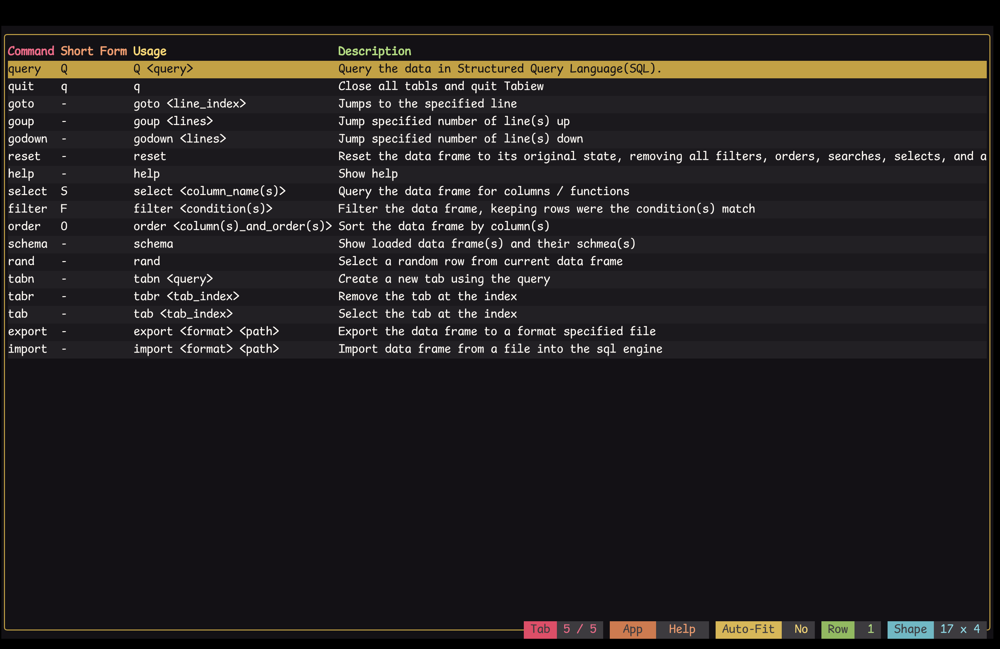

# Tabiew Tutorial

Welcome to the tutorial for Tabiew, a powerful terminal-based application designed to help you view and query tabular files directly from your command line. With Tabiew, you can efficiently manipulate and analyze data in various formats, making it an essential tool for data-related professions and enthusiasts alike. In this guide, we'll walk you through the fundamental features and functionalities of Tabiew, enabling you to maximize its potential for your data handling needs.

In this tutorial, the following CSV files are used as examples, which can be found in the same directory as `tutorial.md` file:

1. **housing.csv**: The housing price dataset.
2. **user.csv**: A set of users with their properties generated by a Language Learning Model (LLM).
3. **company.csv**: A set of companies with their properties generated by an LLM.
4. **employment.csv**: A relation table between user and company, indicating when a user got employed by a company.

It is recommended that you take the time to look at each CSV file to grasp its structure and content.

## Opening file(s)

To open a single file in Tabiew, simply use the following command:

```shell
tw <file_name>
```

Needless to say that `<file_name>` should be replaced with the name of the file you wish to open. For instance, to open the housing price dataset file, use the following command:

```shell
tw housing.csv
```

This command will load the `housing.csv` file and display the following page:



As shown in the image, the tabular data is displayed the main table, while the status bar at the bottom provides table properties such as name and shape.

### Supported formats

Other than `csv`, Tabiew also supports other formats such as Parquet, JSON, JSON-Line, Arrow, FWF, and Sqlite. For instance, to open a parquet file named `sample.parquet`, use the following command:

```shell
tw sample.parquet -f parquet
```

If no specific format is provided in the argument, Tabiew attempts to infer it based on the file extension.

## Command Pallete

Command pallete is activated by pressing `:`. While in the command pallete, press `enter` to execute the entered command or `esc` to return to the table.



## Table Navigation & Visualization

Use these key mappings to navigate through and better visualize your data:

|Key Combination|Action|
|-|-|
| `k` or `Arrow Up`| Move up one row in the table|
| `j` or `Arrow Down`| Move down one row in the table|
| `h` or `Arrow Left`| Scroll table left|
| `l` or `Arrow Right`| Scroll table right|
| `Page Up` or `Ctrl+b`| Move one page up|
| `Page Down` or `Ctrl+f`| Move one page down|
| `Ctrl+u`| Move up half a page|
| `Ctrl+d`| Move down half a page|
| `Home` or `g`| Move to the first row|
| `End` or `G`| Move to the last row|
| `e`| Toggle table auto-fit|
| `f`| Toggle table border|


Alternatively, you can use the `goto` command to jump to a specific row, or just start entering the row number, and the app will automatically enter the command for you.

## Sheet View

By default, all rows are visualized in a single line in the table view. Furthermore, the columns are squeezed to fix the screen if the required table width is larger than the screen. Therefore, to enhance readability, you can open the **sheet view** by pressing the `enter` key. The sheet view allows you to visit each row individually and scroll if it doesn't fit into a page.



## Sheet View Navigation

When in sheet view, you can scroll up and down in the sheet using `Shift+k` or `Shift+Arrow Up` and  `Shift+j` or `Shift+Arrow Down`.

Press `q` to close the sheet view.

## Opening Multiple Files

If you enter multiple file names after the `tw` command, all files will open in different tabs. For instance, running the command

```shell
tw housing.csv user.csv
```

opens `housing.csv` and `user.csv` in separate tabs, allowing you to switch between them and view or compare the contents.

Alternatively, you can use a wildcard to open all CSV files in the directory:

```shell
tw *.csv
```

You can use `H` (`Shift+h`) to move to the previous tab and `L` (`Shift+l`) to move to the next tab.

## Query

Tabiew allows you to query your data using SQL for powerful data manipulation and analysis. To perform a query, use the `Q` or `query` command followed by your SQL statement. For example, to query the `housing.csv` for houses priced above $500,000, located near the main road, and with at least 4 bedrooms, use the following command:

```sql
Q SELECT * FROM housing WHERE price > 500000 AND mainroad = 'yes' AND bedrooms >= 4
```

Or to query `housing.csv` for the average area of houses grouped by the number of bedrooms and bathrooms, use the following command:

```sql
query SELECT bedrooms, bathrooms, AVG(area) as avg_area FROM housing GROUP BY bedrooms, bathrooms
```

If it is prefered to open the results in a new tab, use the `tabn` command followed by your SQL statement. For example:

```sql
tabn SELECT * FROM user WHERE marriage='Married' AND balance < 10000
```


The table names are their file names without the extension. For instance, the table name for `housing.csv` is `housing`. If multiple files have the same name, subsequent files will have `_2`, `_3`, and so on appended to their names. The `:schema` command displays all loaded tables.



## Inline Query

Inline queries provide a convenient way to manipulate the current table. These queries are shorter versions of standard SQL executed on the data displayed in the table rather than the entire dataset. Here are the commands to perform inline queries:

| Command| Example| Description|
|-|-|-|
| `S` or `select`| `S price, area, bedrooms, parking` | Select specific columns or functions from the current data frame. |
| `F` or `filter`| `F price < 20000 AND bedrooms > 4` | Filter the current data frame, keeping rows that match the specified conditions.|
| `O` or `order` | `O area` | Sort the current data frame by the specified column(s).|

For instance, the chain of

```sql
S price, area, bedrooms, parking
F price > 20000
F bedrooms > 4
O area
```

on the complete housing table is equivalent to:

```sql
SELECT price, area, bedrooms, parking
FROM housing
WHERE price > 20000 AND bedrooms > 4
ORDER BY area;
```

Additionally, for more complex queries, the selected data frame can be accessed with the name `_` in SQL queries.
```sql
SELECT price, area, bedrooms, parking
FROM _
WHERE price > 20000 AND bedrooms > 4
ORDER BY area;
```

If you need to return the table to its original state, you can use the the `Ctrl+r` key combinatio or `reset` command.

## Importing

After opening Tabiew, you can use the `import` command to import new data frames. The general syntax of the command is as follows:

```sh
import <format> <path>
```

For example, to import a `parquet` file, you would use the following command:

```sh
import parquet sample.parquet
```

Some formats, like `csv` and `fwf`, accept additional arguments. These arguments can be specified within square brackets `[]` immediately after the format. For example, a TSV file could be imported using the following command:

```sh
import csv[\t no-header] sample.tsv
```

It goes without saying that, Not providing arguments for `csv` or `fwf` results in using default arguments instead.

### Arguments for `csv` Format

When importing `csv` files, the following rules apply:

- Including `no-header` or `nh` indicates that the target file does not contain a header.
- The first character in the arguments is treated as the separator character.
- The second character in the arguments is treated as the quote character.
- Only `\t` is supported from the escape characters.

### Arguments for `fwf` Format

When importing `fwf` files, the following rules apply:

- Including `no-header` or `nh` indicates that the target file does not contain a header.
- Including `flexible-width` or `fw` allows the file to be read with flexible column widths.
- The first positive integer specifies the separator length between columns.
- Any subsequent positive integers specify the widths of the columns.


## Exporting

At any time during explorations, you can export the current data frame to `csv`, `tsv`, `parquet`, `json`, `jsonl`, and `arrow` using the following command:

```sql
:export <format> <path>
```

## Fuzzy Search

You can perform fast fuzzy searches across all columns while in table view by pressing `/` to enter the fuzzy search mode. Typing while in search mode filters the data frame according to the entered term. Press `enter` to apply the filter to the data frame. Otherwise, rollback by pressing `esc`.



## Scripting

Tabiew supports basic scripting functionality. The script is executed at startup by adding `--script <script_file>` to the command-line arguments. The script must consist of commands only. For example, the following script filters houses with an area between 7500 and 10000, exports the results to `results.csv`, and then exits the application:

```plaintext
F area > 7500
F area < 10000
export csv results.csv
q
```


## Help Command

To view all available commands and their descriptions, use the `help` command. This command displays a list of all commands, along with their usage and examples.


